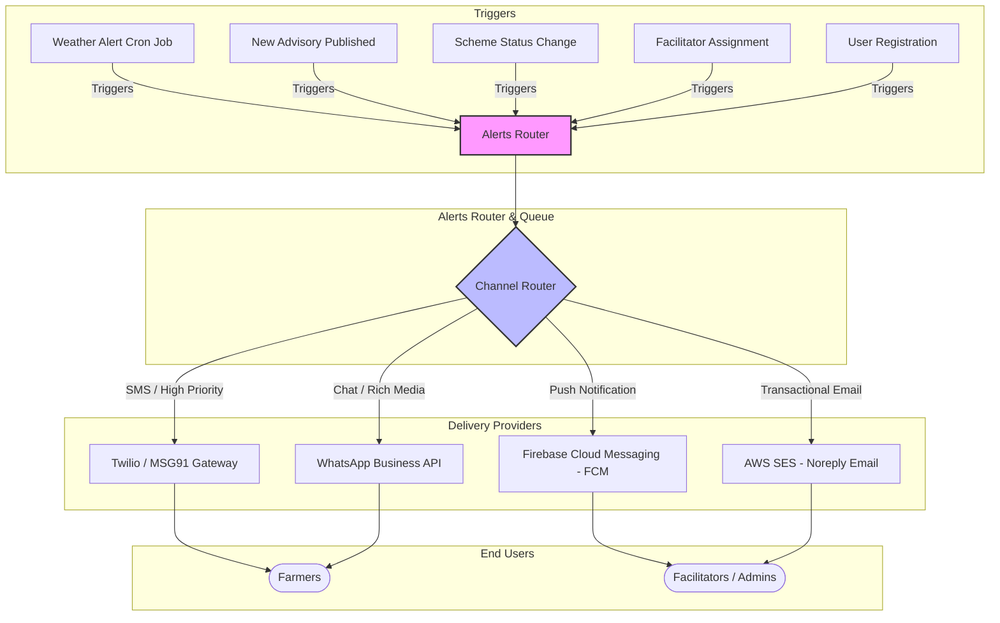

# CLIC: Product Cost Estimation & Infrastructure Architecture

This document provides a comprehensive cost estimation and infrastructure architecture report for scaling the **CLIC (Climate/Crop Learning & Information Centre)** application from its current frontend-only prototype to a production-grade, secure, and highly available mobile-responsive web portal. 

---

## 1. System Features & Backend Scope

To build the backend, the following core features must be developed:
*   **User & Role-based Authentication:** Secure sign-up/login for Farmers (localized credentials, phone-based OTP, or email) and Facilitators (full email/password credentials, regional coordinator access).
*   **Advisory Content Management (CMS):** A portal for agricultural experts to publish pest alerts, stage-wise packages of practices, and crop tips.
*   **Weather & Agro-Met Alerts Engine:** Automated cron jobs pulling meteorological data from third-party APIs and triggering localized advice (e.g., delaying pesticide spray due to rain).
*   **Market Price Aggregation:** Scrapers or API connectors to fetch live commodity prices from local APMCs (e.g., AGMARKNET) and map price trends.
*   **Groundwater Monitoring Logs:** Backend storage to log historical table readings by location, with facilitator-facing inputs.
*   **Schemes & Custom Hiring Booking Engine:** Database schemas to process government subsidy applications and handle bookings for renting agricultural equipment (Custom Hiring Centers).
*   **Communication Hub:** Orchestrates automated crop alerts, transactional notifications, and noreply emails.

---

## 2. Communications Architecture (Alerts, Notifications & Email)

The communication backend manages transactional and broadcast alerts. Given the target demographic (farmers and rural agricultural facilitators), the architecture leverages SMS, WhatsApp, Push Notifications, and Email.

### Alerts & Notifications Workflow

*   **Email (noreply@clic.org):** Used primarily for facilitator accounts, password resets, onboarding notifications, and PDF scheme application exports. Managed via Amazon SES.
*   **SMS:** Critical for reaching farmers in low-bandwidth or offline zones (OTP login and high-priority weather alerts).
*   **WhatsApp:** Preferred channel for rich advisories (sending pest photos, audio manuals, or PDF brochures).
*   **Push Notifications (FCM):** Sent directly to the facilitator's web/mobile dashboard.

---

## 3. Infrastructure & Operational Costs (OpEx)

Infrastructure costs depend directly on scale. The tables below show costs across three development phases:
1.  **Pilot Phase** (up to 2,000 active users)
2.  **Growth Phase** (10,000 - 50,000 active users)
3.  **Scale Phase** (100,000+ active users)

### A. Infrastructure Components (Cloud Services)

| Component | Technology Recommended | Pilot Cost (Monthly) | Growth Cost (Monthly) | Scale Cost (Monthly) |
| :--- | :--- | :--- | :--- | :--- |
| **Backend Servers** | Node.js/Express (hosted on Render/Heroku for Pilot; AWS ECS/Fargate for Scale) | $15 | $120 | $500 - $900 |
| **Database** | Managed PostgreSQL (Supabase / AWS RDS) | $15 (Free/Basic) | $60 | $300 |
| **Caching & Queue** | Redis (Upstash / AWS ElastiCache) | $0 (Free tier) | $30 | $150 |
| **Object Storage** | AWS S3 (Images, learning PDFs, video clips) | $5 | $25 | $120 |
| **CDN & DNS Security**| Cloudflare (Pro / Enterprise for Scale) | $0 (Free) | $20 | $200 |
| **Monitoring & Logs** | Sentry (Error tracking) + Datadog | $0 (Free tier) | $50 | $350 |
| **Total Cloud Infra** | | **$35** | **$305** | **$1,620 - $2,020** |

### B. Third-Party API & Notification Services

| Service Channel | Technology / Provider | Pilot Cost (Monthly) | Growth Cost (Monthly) | Scale Cost (Monthly) |
| :--- | :--- | :--- | :--- | :--- |
| **SMS Gateway** | Twilio or MSG91 (0.01$ / SMS average) | $20 (~2,000 SMS) | $300 (~30k SMS) | $1,500 (~150k SMS) |
| **WhatsApp API** | Meta Cloud API (via Twilio/360dialog) | $10 (~100 chats) | $250 (~2.5k chats) | $1,500 (~15k chats) |
| **Noreply Email** | AWS SES ($0.10 per 1,000 emails) | $0.50 (~5,000 sent) | $5.00 (~50k sent) | $25.00 (~250k sent) |
| **Weather API** | OpenWeatherMap / Meteoblue | $0 (Free Tier) | $45 (Startup plan) | $180 (Professional) |
| **Push Notifications**| Firebase Cloud Messaging (FCM) | $0 (Free) | $0 (Free) | $0 (Free) |
| **Geocoding & Maps** | Google Maps Platform / Mapbox | $0 (Free credits) | $50 | $250 |
| **Total Third-Party** | | **$30.50** | **$650.00** | **$3,455.00** |

> [!NOTE]
> For SMS and WhatsApp, regional pricing varies significantly. For example, sending SMS in North America costs ~$0.0079/SMS, while in India it averages ~$0.0016/SMS. The pricing above uses standard blended international rates.

---

## 4. Product Development Labor Costs (CapEx)

Developing this system requires a professional product team over a **12-to-16-week timeline** to design, code, secure, test, and deploy the entire solution.

### A. Team Structure & Work Effort Estimates

| Phase | Description | Key Deliverables | Estimated Effort |
| :--- | :--- | :--- | :--- |
| **Phase 1: Architecture & UI/UX** | System design, database schema modeling, user journeys for rural farmers, localization strategy. | High-fidelity wireframes, DB Schema, API specification. | 3 Weeks |
| **Phase 2: Core Backend Dev** | Setting up Auth, PostgreSQL, API routers, Admin CMS, and groundwater logging. | Fully functional REST/GraphQL API, secure user roles. | 4 Weeks |
| **Phase 3: Integration & Features**| Implementing Weather API, APMC market price pipelines, booking logic, and maps. | Dynamic market trend views, agro-met advisory integration. | 4 Weeks |
| **Phase 4: Alerts Engine** | Integrating AWS SES for email, Twilio for SMS/WhatsApp, FCM for dashboard alerts. | Automated multi-channel notification engine. | 2 Weeks |
| **Phase 5: QA & Launch** | Security auditing, unit testing, performance testing, and Production setup. | Bug-free deployment, secure AWS environments. | 2 Weeks |
| **Total Development Time**| | | **15 Weeks (~600 Hours)** |

### B. Development Budget by Sourcing Model

The actual cost of development depends heavily on your choice of outsourcing or hiring. Below are standard cost expectations across three common sourcing models:

```mermaid
gantt
    title CLIC Backend & Core Feature Implementation (15 Weeks)
    dateFormat  X
    axisFormat W%W
    
    section Design & DB
    Specs & UX Design       :active, p1, 0, 3
    section Core APIs
    Auth & Basic Features   :crit, p2, 3, 7
    section Services Integration
    Weather & Market APIs   :p3, 7, 11
    section Notifications
    Alerts, SMS & Email Engines: p4, 11, 13
    section Launch Prep
    QA, Security & Deploy   :p5, 13, 15
```

#### Sourcing Models Cost Range

1.  **Offshore Agency / Freelance Team (India / SE Asia / Eastern Europe)**
    *   *Average Hourly Rate:* $30 – $55/hr
    *   *Team Composition:* 1 Full-Stack Dev, 1 UI/UX designer (part-time), 1 QA (part-time).
    *   **Estimated Total Cost: $20,000 – $38,000**
2.  **Mid-Market Digital Product Agency (Latin America / Western Europe)**
    *   *Average Hourly Rate:* $60 – $95/hr
    *   *Team Composition:* 1 Lead Architect, 1 Frontend Dev, 1 Backend Dev, 1 Designer, 1 QA.
    *   **Estimated Total Cost: $40,000 – $75,000**
3.  **Onshore Premium Agency (US / UK / Canada)**
    *   *Average Hourly Rate:* $120 – $180/hr
    *   *Team Composition:* Full dedicated agile scrum team (PM, Architect, Developers, QA, DevOps).
    *   **Estimated Total Cost: $85,000 – $140,000**

---

## 5. Total Cost Summary Matrix

| Metric | Pilot Stage (2,000 Farmers) | Growth Stage (50,000 Farmers) | Enterprise Scale (100,000+ Farmers) |
| :--- | :--- | :--- | :--- |
| **Initial Build Cost (CapEx)**| $25,000 (Average Freelance/Offshore) | $55,000 (Mid-market Agency) | $110,000 (Premium Onshore) |
| **Monthly Infrastructure (OpEx)**| $35.00 | $305.00 | $1,820.00 |
| **Monthly Notification API Fees**| $30.50 | $650.00 | $3,455.00 |
| **Total Monthly Running Cost** | **$65.50 / month** | **$955.00 / month** | **$5,275.00 / month** |

> [!TIP]
> **Cost Optimization Tip:** To keep notifications cost-effective at launch:
> 1. Use **FCM Web Push Notifications** (completely free) for facilitators and active smartphone users.
> 2. Limit SMS alerts to critical messages (e.g., OTP login, severe weather warnings) and route general updates through WhatsApp/Email.
> 3. Use **AWS SES** for all business communications; it is significantly cheaper than standard marketing platforms.
